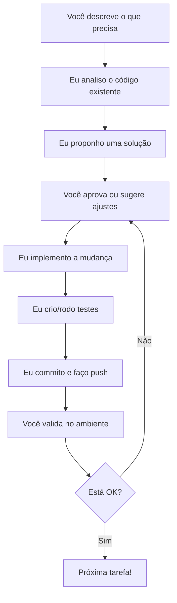

# 🤖 Capacidades do Agente IA nesta Sessão

## 📋 O Que Posso Fazer?

Olá! Sou um agente de IA avançado do GitHub Copilot com capacidades completas de desenvolvimento. Nesta sessão, posso ajudá-lo com uma ampla variedade de tarefas relacionadas ao seu **Sistema de Trading Quantitativo**.

---

## 🎯 Capacidades Principais

### 1. 📝 Análise e Compreensão de Código
- ✅ Explorar e entender toda a estrutura do projeto
- ✅ Analisar código Python existente
- ✅ Explicar como funciona qualquer parte do sistema
- ✅ Documentar código e funções
- ✅ Identificar problemas e bugs
- ✅ Revisar qualidade do código

### 2. 💻 Desenvolvimento e Modificação de Código
- ✅ Criar novos indicadores técnicos
- ✅ Adicionar novas funcionalidades ao sistema
- ✅ Refatorar código existente
- ✅ Otimizar performance
- ✅ Corrigir bugs e erros
- ✅ Implementar novos algoritmos de trading

### 3. 🔧 Manutenção e Configuração
- ✅ Atualizar dependências (requirements, pyproject.toml)
- ✅ Configurar ambientes virtuais
- ✅ Criar e modificar scripts de automação
- ✅ Configurar CI/CD (GitHub Actions)
- ✅ Gerenciar estrutura de pastas

### 4. 🧪 Testes e Validação
- ✅ Criar testes unitários
- ✅ Executar testes existentes
- ✅ Implementar testes de integração
- ✅ Validar estratégias de trading
- ✅ Realizar backtests
- ✅ Análise de resultados

### 5. 📊 Visualização e Dashboard
- ✅ Criar novos gráficos e visualizações
- ✅ Melhorar dashboards Streamlit existentes
- ✅ Adicionar novas métricas ao dashboard
- ✅ Criar relatórios automatizados
- ✅ Implementar gráficos interativos com Plotly

### 6. 🗄️ Banco de Dados e Dados
- ✅ Otimizar queries SQLite
- ✅ Adicionar novos ativos ao universo
- ✅ Implementar novos data fetchers
- ✅ Melhorar cache e armazenamento
- ✅ Migrar estrutura de dados

### 7. 📚 Documentação
- ✅ Criar documentação técnica
- ✅ Escrever tutoriais
- ✅ Documentar APIs
- ✅ Criar guias de uso
- ✅ Traduzir documentação

### 8. 🔍 Análise e Pesquisa
- ✅ Pesquisar novos indicadores técnicos
- ✅ Buscar informações sobre estratégias de trading
- ✅ Investigar bibliotecas e ferramentas
- ✅ Analisar padrões de mercado
- ✅ Sugerir melhorias no sistema

---

## 🎓 Exemplos Práticos para Este Projeto

### Exemplo 1: Adicionar Novo Indicador Técnico
**Você pode me pedir:**
> "Adicione o indicador ADX (Average Directional Index) ao sistema"

**Eu farei:**
1. Criar o arquivo `src/co_piloto_quant/indicators/adx.py`
2. Implementar a função de cálculo do ADX
3. Integrar ao `feature_factory.py`
4. Criar testes para validar
5. Atualizar documentação

### Exemplo 2: Criar Nova Estratégia de Trading
**Você pode me pedir:**
> "Crie uma estratégia de cruzamento de médias móveis com stop loss"

**Eu farei:**
1. Implementar a lógica da estratégia
2. Adicionar gerenciamento de risco (stop loss)
3. Criar script de backtest
4. Gerar relatório de performance
5. Adicionar visualização dos trades

### Exemplo 3: Melhorar Dashboard
**Você pode me pedir:**
> "Adicione uma aba no dashboard mostrando correlação entre ativos"

**Eu farei:**
1. Modificar `scripts/run_dashboard.py`
2. Adicionar cálculo de matriz de correlação
3. Criar visualização interativa (heatmap)
4. Adicionar filtros por período
5. Testar funcionalidade

### Exemplo 4: Otimizar Performance
**Você pode me pedir:**
> "O processamento de features está muito lento, otimize"

**Eu farei:**
1. Analisar o código atual
2. Identificar gargalos
3. Implementar paralelização onde possível
4. Usar vectorização do pandas/numpy
5. Comparar performance antes/depois

### Exemplo 5: Adicionar Novos Ativos
**Você pode me pedir:**
> "Adicione criptomoedas (BTC, ETH) ao universo de ativos"

**Eu farei:**
1. Modificar `universe.py` para incluir crypto
2. Ajustar `data_fetching.py` para suportar tickers de crypto
3. Atualizar lógica de download
4. Validar dados baixados
5. Documentar mudanças

### Exemplo 6: Criar Alertas Automáticos
**Você pode me pedir:**
> "Crie um sistema que me alerta quando um ativo atinge condições específicas"

**Eu farei:**
1. Criar módulo de alertas
2. Implementar checagem de condições
3. Adicionar notificações (email, telegram, etc)
4. Criar script de monitoramento contínuo
5. Documentar configuração

---

## 🚫 O Que NÃO Posso Fazer

- ❌ Acessar suas credenciais de corretoras ou contas reais
- ❌ Executar trades reais no mercado
- ❌ Garantir lucros ou performance de estratégias
- ❌ Acessar dados privados ou proprietários externos
- ❌ Fazer push diretamente para branches protegidas (main/master)

---

## 💡 Como Me Usar de Forma Eficiente

### ✅ Boas Práticas

1. **Seja Específico**: 
   - ❌ "Melhore o código"
   - ✅ "Otimize a função `calculate_bollinger_bands` para ser mais rápida"

2. **Forneça Contexto**:
   - ✅ "Estou tendo erro X ao rodar Y, aqui está o traceback..."
   - ✅ "Quero adicionar Z, similar ao que já existe em W"

3. **Teste Incremental**:
   - ✅ Peça uma mudança por vez
   - ✅ Valide antes de pedir a próxima
   - ✅ Isso evita problemas em cascata

4. **Revise as Mudanças**:
   - ✅ Verifique o código que eu gerar
   - ✅ Teste antes de fazer merge
   - ✅ Sugira ajustes se necessário

### 🎯 Prompts Eficientes para Este Projeto

```markdown
✅ "Adicione o indicador Ichimoku Cloud ao feature_factory"
✅ "Crie um backtest para estratégia de reversão à média"
✅ "Otimize o download de dados para rodar em paralelo"
✅ "Adicione testes unitários para o módulo de indicadores"
✅ "Crie um relatório HTML com análise de todos os ativos"
✅ "Implemente stop loss dinâmico baseado em ATR"
✅ "Adicione logging detalhado ao data_manager"
✅ "Crie documentação API para o módulo de dados"
```

---

## 🔄 Fluxo de Trabalho Recomendado



---

## 📞 Exemplos de Comandos Diretos

### Análise
```
"Explique como funciona o sistema TPM"
"Mostre a estrutura de pastas do projeto"
"Liste todos os indicadores disponíveis"
"Analise a performance do backtest atual"
```

### Desenvolvimento
```
"Crie um novo indicador de momentum"
"Adicione suporte para intraday (1h, 15m)"
"Implemente walk-forward optimization"
"Crie um script para exportar dados para Excel"
```

### Debugging
```
"Por que o download de PETR4.SA está falhando?"
"Corrija o erro no cálculo do IFR"
"O dashboard não está mostrando dados, investigue"
"Valide se todos os testes estão passando"
```

### Documentação
```
"Documente a função add_all_features"
"Crie um README para a pasta indicators/"
"Escreva um tutorial de como adicionar novos ativos"
"Traduza o README para inglês"
```

---

## 🎁 Recursos Avançados

### Agentes Especializados
Posso delegar tarefas para agentes especializados:
- **explore**: Para explorar código complexo
- **task**: Para executar comandos e testes
- **code-review**: Para revisar mudanças de código

### Ferramentas de Desenvolvimento
Tenho acesso a:
- ✅ Bash (executar comandos)
- ✅ Git (controle de versão)
- ✅ Editor de arquivos (criar, modificar, deletar)
- ✅ Grep/Glob (busca rápida de código)
- ✅ GitHub API (para issues, PRs, workflows)
- ✅ Web search (para pesquisar informações atualizadas)

---

## 📊 Casos de Uso Específicos para Trading Quantitativo

### 1. Desenvolvimento de Estratégias
- Implementar lógica de entrada/saída
- Adicionar filtros de qualidade
- Criar sistemas multi-timeframe
- Implementar gestão de risco

### 2. Análise de Dados
- Processar dados históricos
- Calcular estatísticas de ativos
- Detectar anomalias e toxicidade
- Análise de correlação e cointegração

### 3. Backtesting
- Criar engines de backtest
- Implementar métricas de performance
- Análise de drawdown
- Monte Carlo simulation

### 4. Machine Learning
- Preparar datasets para ML
- Criar features engineering
- Implementar modelos preditivos
- Validação cross-validation

### 5. Monitoramento
- Health checks automáticos
- Alertas de falhas
- Logging estruturado
- Dashboards de monitoramento

---

## 🚀 Próximos Passos Sugeridos

Para maximizar o uso desta sessão, você pode:

1. **Definir uma tarefa específica** que precisa
2. **Me mostrar exemplos** do que deseja (se houver)
3. **Especificar requisitos** técnicos ou de negócio
4. **Validar comigo** se a abordagem faz sentido
5. **Iterar** até atingir o resultado desejado

---

## 📝 Notas Finais

- Todas as mudanças são versionadas no Git
- Posso criar branches para testar mudanças
- Faço commits incrementais e organizados
- Sempre valido código com testes quando possível
- Documentação é parte do processo

**Estou pronto para ajudar! O que você gostaria que eu fizesse?** 🚀

---

**Última atualização**: 8 de fevereiro de 2026  
**Sessão**: GitHub Copilot AI Agent
