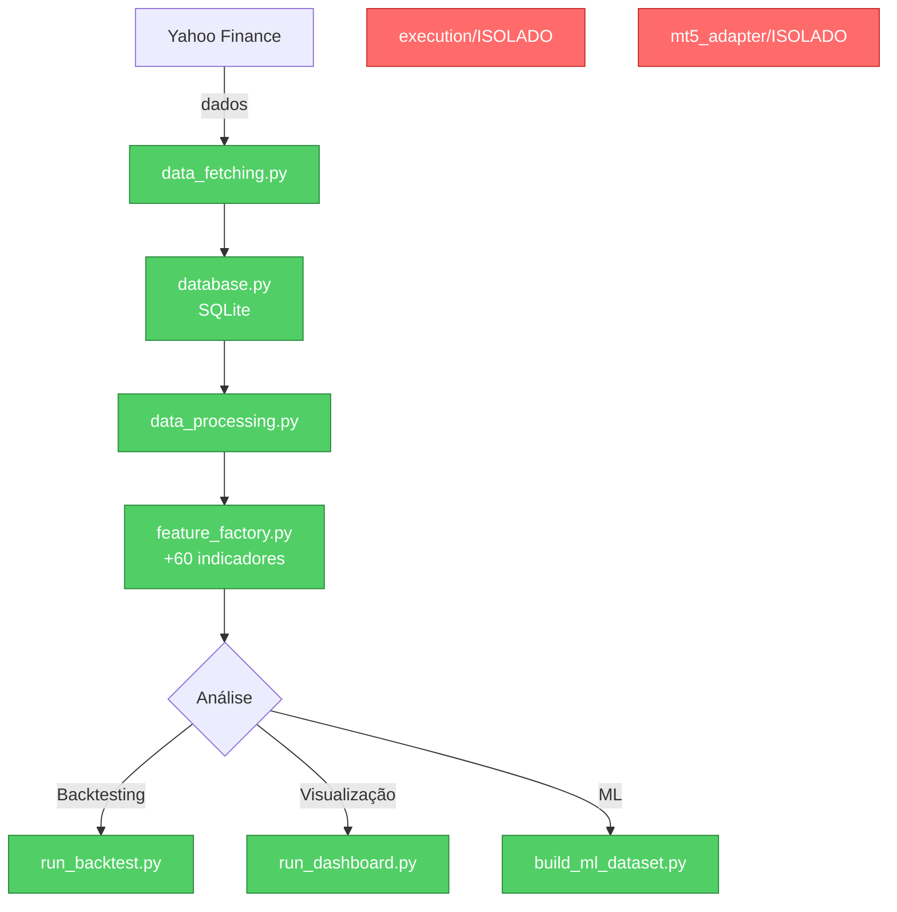

# 📋 SUMÁRIO EXECUTIVO - VERIFICAÇÃO COMPLETA

## 🎯 CONCLUSÃO

Seu sistema **SIM, possui componentes de bot de trading**, mas **estão DESATIVADOS e ISOLADOS**. Não afetam o funcionamento do sistema de análise quantitativa atual.

---

## 📊 ANÁLISE FINAL

### ✅ BOM NEWS

1. **Os componentes de bot NÃO estão sendo usados**
   - Nenhum arquivo no sistema importa `ExecutionManager` ou `TradingOrchestrator`
   - Sua pipeline de análise é independente
   - Seu dashboard (Streamlit) não referencia bot automation

2. **Seu sistema é 100% análise quantitativa**
   - ✅ Coleta dados (Yahoo Finance)
   - ✅ Calcula indicadores (60+ features)
   - ✅ Executa backtests históricos
   - ✅ Visualiza análises em dashboard
   - ❌ NÃO executa trades automaticamente

### 🚩 COMPONENTES DE BOT ENCONTRADOS

```
src/co_piloto_quant/
├── execution/                          ← PASTA DE BOT (ISOLADA)
│   ├── manager.py                      (gerencia MT5)
│   └── orchestrator.py                 (máquina de estados)
├── data/adapters/
│   └── mt5_adapter.py                  (conexão MT5)
└── utils/
    └── telegram_sender.py              (notificações)
```

**Status**: Presentes, mas NÃO integrados ao fluxo principal.

---

## 🔍 VERIFICAÇÃO DE IMPORTS

| Arquivo | Importa Bot? | Status |
|---------|-------------|--------|
| `run_dashboard.py` | ❌ NÃO | ✅ Seguro |
| `build_ml_dataset.py` | ❌ NÃO | ✅ Seguro |
| `run_backtest.py` | ❌ NÃO | ✅ Seguro |
| `scripts/__init__.py` | ❌ NÃO | ✅ Seguro |
| `src/__init__.py` | ❌ NÃO | ✅ Seguro |

---

## 💡 RECOMENDAÇÕES

### Opção 1: **DEIXAR COMO ESTÁ** (Recomendado)
- ✅ Componentes isolados não prejudicam nada
- ✅ Mantenha para referência futura
- ✅ Foco 100% em análise agora

### Opção 2: **LIMPAR AGORA** (Recomendado se quer deletar)
- Remover `src/co_piloto_quant/execution/` completo
- Remover `src/co_piloto_quant/data/adapters/mt5_adapter.py`
- Remover referências a Telegram

### Opção 3: **REFATORAR PARCIALMENTE**
- Manter apenas acesso a dados do MT5 (desativar execução)
- Remover `ExecutionManager` e `TradingOrchestrator`

---

## 🎬 SEU SISTEMA HOJE



---

## 📞 QUAL É A MELHOR AÇÃO?

Recomendo: **DEIXAR COMO ESTÁ POR ENQUANTO**

**Razão**: 
- Componentes isolados não prejudicam nada
- Você está 100% focado em análise
- Se precisar no futuro, estão lá para referência
- Remover agora não adiciona valor imediato

---

## ✅ RESUMO PARA VOCÊ

| Pergunta | Resposta |
|----------|----------|
| Meu sistema tem bot de trade? | Sim, mas isolado |
| O bot está ativo? | NÃO |
| Afeta a análise? | NÃO |
| Meu sistema é quantitativo puro? | SIM ✅ |
| Preciso remover? | Opcional |

---

**Status da Verificação**: ✅ COMPLETA  
**Data**: 8 de fevereiro de 2026  
**Conclusão**: Seu sistema está seguro e focado em análise quantitativa!
